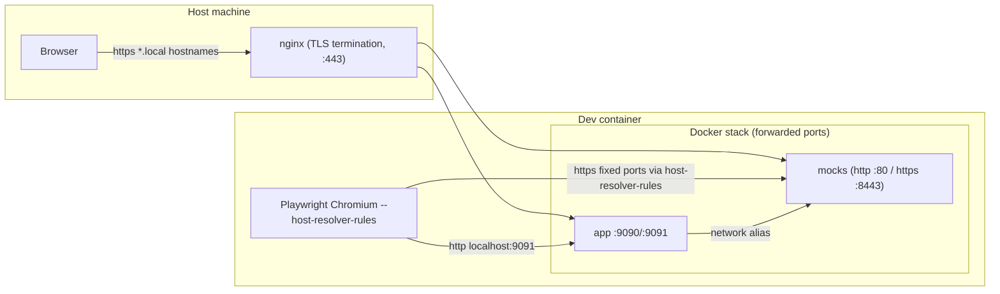

# Reference: local-stack orchestration & containers

Captured essence of the reference stack code (orchestration, per-container
recipes, the image-build helper and network routing). Reproduce these patterns;
adapt names/ports/services to the target app.

## Image build helper

Build an image from a Dockerfile via Testcontainers and return a configurable
container. BuildKit is enabled so `# syntax` frontends apply; images are deleted
on exit.

```ts
export function buildImage(context: string, dockerfileName: string, tag: string) {
  return GenericContainer.fromDockerfile(context, dockerfileName)
    .withBuildkit()
    .build(tag, { deleteOnExit: true });
}
```

A `createLogConsumer(prefix, streamLogs)` helper streams container logs to stdout
only when `streamLogs` is set (noisy in test runs, useful for `dev:local`).

## Orchestration (`startLocalStack`)

One `Network` per run; everything wrapped in try/catch that stops every started
container and the network on failure. Startup is **phased and overlapped**:

1. **Infrastructure first** (everything depends on it): start the AWS mock
   (LocalStack S3+DynamoDB) and the database in parallel; `await` both.
2. **Mocks**: kick off every WireMock mock (they share one image, no build) as a
   batch of promises.
3. **App + real services**: build+start the app container and any run-for-real
   dependency (e.g. datastore) concurrently — each start function builds its own
   image then starts its container, so work interleaves.
4. `await Promise.all([...])` the app, real services, mocks (and the optional
   auth-redirect) together.
5. **Seed** the database *after* the owning service's migrations have created the
   schema (its healthcheck triggers them).
6. Return a `LocalStack` object with `baseUrl`, the auth signing key, mock admin
   URLs and every container handle for teardown.

```ts
const network = await new Network().start();
const [awsContainer, dbContainer] = await Promise.all([
  startAws(network, e2eRoot, panDomainKeys, streamLogs),
  startDb(network, streamLogs),
]);
const mocks = Object.values(MOCK_WIREMOCK_CONFIGS).map(c =>
  startMockWiremock(c, e2eRoot, network, streamLogs));
const workflowStart = startWorkflow(repoRoot, workflowImageTag, network, streamLogs);
const datastoreStart = startDatastore(e2eRoot, datastoreImageTag, network, streamLogs);
const [workflow, datastore, ...startedMocks] =
  await Promise.all([workflowStart, datastoreStart, ...mocks]);
await seedDatabase(dbContainer, e2eRoot);
```

`stopLocalStack(stack)` stops each container (reverse order) then the network.
An `exposeHostAuth` option additionally starts the nginx auth-redirect container
and signs a long-lived cookie for host-browser dev.

## Ports & hostnames (constants)

Fixed host ports are used only where a stable port is required (host browser /
Chromium host-resolver-rules); everything else uses random mapped ports.

- App: container `9090`, host `9091`. auth-redirect nginx: container `80`, host `9090`.
- WireMock HTTP port `80`; the https-serving mocks also listen on `8443`.
- Browser-facing mocks get fixed host ports (e.g. Composer `9081/9082`,
  Presence `9070/9071`, Telemetry `3132/3133`).
- Each mock registers the **real upstream hostname** as a Docker network alias so
  the app's server-side calls resolve to it with no config override.

## Per-container recipes

### AWS mock (LocalStack: S3 + DynamoDB in one container)
```ts
new GenericContainer("localstack/localstack:4")
  .withNetwork(network)
  .withNetworkAliases("localstack", "s3.localstack",
     "permissions-cache.s3.localstack", "pan-domain-auth-settings.s3.localstack")
  .withEnvironment({ SERVICES: "s3,dynamodb", AWS_DEFAULT_REGION: "eu-west-1" })
  .withExposedPorts(4566)
  .withWaitStrategy(Wait.forLogMessage(/Ready\./, 1))
  .start();
// then seed S3 + DynamoDB from the host (see seeding.md)
```
**S3 gotcha:** LocalStack extracts the bucket from the Host header only when it
contains `.s3.`, so S3 aliases must sit under an `s3.` domain.

### Database (stock Postgres)
```ts
new GenericContainer("postgres:17-alpine")
  .withNetwork(network).withNetworkAliases("workflow-db-e2e...")
  .withEnvironment({ POSTGRES_USER, POSTGRES_PASSWORD, POSTGRES_DB })
  .withExposedPorts(5432)
  .withWaitStrategy(Wait.forLogMessage(/database system is ready to accept connections/, 2))
  .start();
```

### Mocks (one shared WireMock image) — see fixtures reference
A single `MOCK_WIREMOCK_CONFIGS` table drives `startMockWiremock(config, ...)`;
each entry differs only by fixture folder, network aliases, ports, `https` and
`templating` flags. WireMock runs as `root` (privileged port 80), bind-mounts
`fixtures/<service>` read-only at `--root-dir`, waits on `/__admin/health`.

### App under test (CI / `test:ci` only; native in dev)
Toolchain-only image, tiny build context (temp dir with just `.tool-versions` +
the Dockerfile), repo **bind-mounted read-write**, run from source:
```ts
workflowImage
  .withNetwork(network).withNetworkAliases("workflow-frontend")
  .withBindMounts([{ source: repoRoot, target: "/workflow-frontend", mode: "rw" }])
  .withEnvironment({ AWS_ENDPOINT_URL_S3, AWS_ENDPOINT_URL_DYNAMODB,
                     AWS_ACCESS_KEY_ID: "test", AWS_SECRET_ACCESS_KEY: "test", LOCAL: "true" })
  .withExposedPorts({ container: 9090, host: 9091 })
  .withWaitStrategy(Wait.forHttp("/management/healthcheck", 9090).forStatusCode(200))
  .start();
```

### Run-for-real dependency (e.g. datastore)
Same toolchain-only + bind-mount pattern. Resolve the checkout dir from
`WORKFLOW_BACKEND_DIR` or a default `target/<dependency>`; mount it read-write and
run from source. Long startup timeout (sbt resolves/compiles on first start).
The checkout itself is done by a small script that clones the private/public repo
into `target/<dependency>` (in CI, via a GitHub App token for private repos).

### auth-redirect (optional host-browser dev)
Stock `nginx:alpine` with a bind-mounted config template (`envsubst` at start);
sets the auth cookie on `/cookie` and proxies everything else to the app. Fixed
host port so it's bookmarkable.

## Network routing



- **Host browser → nginx (TLS) → forwarded ports** (manual dev via `dev:local`).
- **Playwright Chromium → services directly**: app over plain HTTP on its
  forwarded port; cross-origin HTTPS APIs mapped by `--host-resolver-rules` to the
  mock's fixed host port (`ignoreHTTPSErrors: true`).
- **Server-side** app calls reach mocks via Docker **network aliases** (the real
  hostnames), needing no override.
