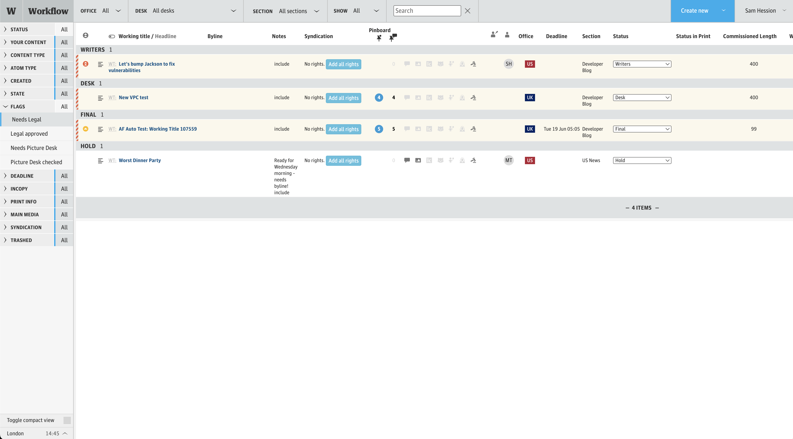

# Workflow Frontend

Workflow is the Guardian's content tracking system, part of the Digital CMS. It allows editorial staff to track content through the production pipeline, from commission to publication.

This repository contains the frontend app and its Scala API layer, whilst the backend apps are in a separate repository: [workflow](https://github.com/guardian/workflow).

## Contents

- [Introduction](#1-introduction)
- [Getting Started](#2-getting-started)
- [How It Works](#3-how-it-works)
- [Useful Links](#4-useful-links)
- [Terminology](#5-terminology)

## 1. Introduction

Workflow is used by Guardian editorial staff to manage content in production. Content is represented as "stubs" which are typically analogous to content in Composer and are often linked together. However, stubs can also represent other forms of content such as media atoms.

This repository contains the frontend app as well as its own backend (Scala API layer) which interacts with the [workflow](https://github.com/guardian/workflow) backend app: Datastore.



Frontend features:

- **Dashboard** — a filterable, real-time view of all content in production, with status tracking, assignees, priorities, and due dates.
- **Content/stub management** — create and update content stubs, including metadata such as section, legal status, commissioned length, production office, and planned publication details (newspaper book, page, and digital publication date).
- **Admin interface** — manage editorial desks, sections, and section-to-desk mappings (restricted via the Permissions service).
- **Editorial support teams** — manage and view the status of editorial support staff.
- **Presence indicators** — see who else is viewing the same content in real time (via WebSocket).

## 2. Getting Started

### Prerequisites

- Java 11
- Node
- sbt
- AWS credentials: `workflow` and `capi` (API Gateway invocation) profiles from Janus

Workflow Frontend needs to talk to  workflow [Datastore](https://github.com/guardian/workflow/blob/main/README.md#2-getting-started) and [Preferences](https://github.com/guardian/editorial-preferences). It can use either a local backend or the CODE environment.

### Setup

1. Run the setup script:

   ```sh
   ./scripts/setup.sh
   ```

2. Download the DEV config:

   ```sh
   ./scripts/fetch-config.sh
   ```

If you encounter a `Module build failed` error due to Node Sass during setup, run `npm rebuild node-sass`.

### Connecting to a datastore

#### CODE 

Create an SSH tunnel to a workflow-frontend CODE instance. You will need [ssm-scala](https://github.com/guardian/ssm-scala) installed.

```sh
./scripts/setup-ssh-tunnel.sh
```

#### Local backend

Alternatively, set up the [workflow backend](https://github.com/guardian/workflow) locally and verify it is running:

```sh
curl -is http://localhost:9095/management/healthcheck
```

### Running

```sh
./scripts/start.sh
```

Certain features require running other services locally, e.g. run [atom-workshop](https://github.com/guardian/atom-workshop) locally to test creating Chart atoms through Workflow.

Note: when running Workflow Frontend locally, some functionality will currently not work. 

  * Connect to CAPI
  * Presence 
  * 'Assign to me'

### Deploying

This project uses continuous deployment on the `main` branch. Merging to `main` triggers a build and deploy via RiffRaff. If you suspect your change hasn't deployed, look for the `Editorial Tools::Workflow::Workflow Frontend` project in RiffRaff.

### Admin Permissions

The `/admin` path allows management of desks and sections. Access is controlled by the Permissions service — not all Workflow users have admin access.

## 3. How It Works

### Architecture

The project hold the user interface for Workflow consisting of a AngularJS based client and Scala Play backend. The backend proxies requests to the [Workflow](https://github.com/guardian/workflow) Datastore app.

#### Shared library (`common-lib/`)

Scala code duplicated between this repo and the workflow backend. Contains API client interfaces and utility code.

## 4. Useful Links

- [Workflow backend](https://github.com/guardian/workflow) — the data layer and core business logic for Workflow.
- [Atom Workshop](https://github.com/guardian/atom-workshop) — used for creating atoms (e.g. charts) through Workflow.
- [Pan-Domain Authentication](https://github.com/guardian/pan-domain-authentication) — the authentication library used across Guardian tools.
- [ssm-scala](https://github.com/guardian/ssm-scala) — required for the SSH tunnel setup script.
- [TROUBLESHOOTING.md](TROUBLESHOOTING.md) — solutions for common local development issues (e.g. AWS auth failures on guest WiFi).

## 5. Terminology

- **Stub** — a content item being tracked in Workflow. A stub represents a story in production and carries metadata such as status, assignee, section, priority, and due date. A stub may or may not have a corresponding piece of content in Composer.
- **Desk** — an editorial team or department (e.g. "News", "Sport"). Desks own sections and are used to filter the dashboard.
- **Section** — an editorial section within a desk (e.g. "UK News", "Football"). Content is assigned to a section.
- **Stage** — the deployment environment: Dev (local), Code (staging), or Prod (production).
- **CAPI** — the Guardian Content API, used to fetch published/preview content metadata.
- **Composer** — the Guardian's content editing tool. Workflow links to Composer for content creation and editing.
- **Presence** — a real-time indicator showing which users are currently viewing or editing the same content, powered by WebSocket connections.
- **Pan-Domain Auth (panda)** — the Guardian's cross-domain authentication system, providing SSO across editorial tools.
- **RiffRaff** — the Guardian's deployment tool, used for continuous deployment from the `main` branch.
- **Production Office** — the geographical office responsible for a piece of content (e.g. UK, US, AU).
