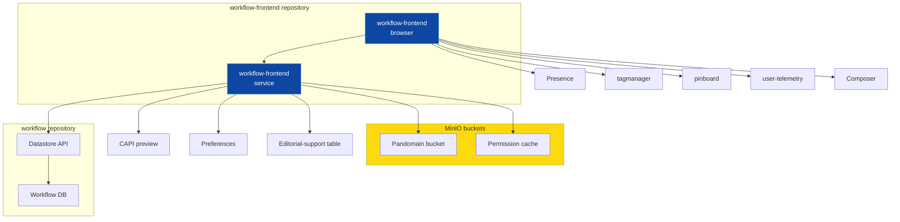

# Setting up containerised end-to-end tests 

## Service dependencies

The workflow-frontend has quite many dependencies. 

To start up the main page of Workflow frontend, we are only required to mock a few endpoints and services:
- S3 bucket for Pan-domain authentication
- S3 bucket for permission cache
- a host for CAPI preview
- four endpoints of Datastore API (desks, sections, section-desk mapping, workflow items)

But as we extend our test coverage to more scenarios that requires those dependencies, we probably need to mock those APIs / endpoints. For example,
- mock Pinboard for showing the in-app Pinboard
- mock editorial support dynamo table for showing the data on UI correctly

In the end-to-end tests, we may want to decide where to set the boundary for mocking.

## Boundary for mocking
We may mock the APIs and services used by our Workflow-frontend backend so that our end-to-end tests go through our web frontend and the backend service in the repository. 

Alternatively we may mock the endpoints used by our web frontend directly.

### Mock APIs outside workflow-frontend repository

Pros:
1. The end-to-end tests go through our web frontend and the backend service in the repository.
2. Those tests will also be useful to validate our changes to the backend if we want to modernise the backend later.

Cons:
1. It would be tricky to mock APIs that are consumed by the backend service within our VPC but do not expose to the Internet. It may requires a bit of work to reach those APIs and capture responses.
2. We need to find out what requests (endpoints and parameters) are exactly sent by the backend, even when we work on the frontend only and don't make any changes to the backend. It may adversely affect our work velocity.
3. Different test scenarios in the frontend may require different responses from the backend, but we probably use the same test container for a mocked API across all the test cases. So we either need a more complicated API that allows us to set mocked responses during the test, or we need to prepare a exhausive set of test data.
4. It would be challenging to implement test scenarios that create or change data in the backend, for example, (1) creating a new piece in Composer and (2) changing some fields of a tracked piece in the Workflow DB via the Datastore service.

### Mock APIs used by the web frontend

We may still need a test container to run the backend service because Playwright runs tests by popping up a browser instance and loading URLs. The backend service must be present to serve the pages (for example, via the endpoint `/dashboard`).

We can mock backend APIs through the Playwright's `route` and `routeWebSocket` features.

Pros:
1. It is straightforward to mock backend APIs as we can find sample requests in a browser.
2. Setting mocked responses can be part of test case implementation so it is easy to alter responses to suit the test scenarios without managing a huge set of test data.

Cons:
1. Validate changes to frontend code only.
2. Different handling on the endpoint of the backend API - keep those serving web pages unchanged in the backend API but intercept those serving API.
3. They work in test cases only. So it won't work if we start the test container manually and use the Workflow in the test browser directly.

### Mock APIs outside Workflow

We extend our coverage to the whole Workflow application (workflow-frontend and [workflow backend](https://github.com/guardian/workflow)).

Although workflow-frontend and workflow (backend) are hosted in separate repositories, they functionally are the same application so it is very sensible to start a container running the real Datastore service for end-to-end tests.

I updated the run-local-stack script to check out the "workflow" repository and build two additional containers - one for the Postgres database and another for running the Datastore service.

Pros:
1. The end-to-end tests extends to all backend services of the workflow frontend all the way to the Database.
2. It greatly reduces the amount of mocking as a whole because that part is the major APIs the frontend talks to.
3. It makes it easier to write test cases that involve creating and changing data in the Workflow backend. But we still need a flexible content API for creating new pieces.

Cons:
1. There are still some APIs that are called by the backend service. They may be difficult to mock as described [here](#mock-apis-outside-workflow-frontend-repository).
2. It may take longer to build all the containers to run end-to-end tests.
3. There may be some dependencies on the architecture of the Datastore, for example, just for the purpose of illustration, a new database or a dynamo table are added to the Datastore. It is unlikely / rare though. We may also think about how to organise the docker images and e2e test fixtures across these two repositories.

### Hybrid
Not all of the three options are mutually exclusive, and we may start with a simpler model and develop it into more complex model if need arises.

We can selectly mock backend API responses at network layer in Playwright test cases using `route` feature. Maybe we can mock third-party APIs (those outside Workflow) called by workflow frontend directly in this way.

I think running real Datastore service is very sensible for end-to-end tests as it improves the test coverage and also saves us from creating a lot of mocked responses.

Another big API that is used by Workflow is the Composer APIs, but it is called by the web frontend code directly. Maybe we can mock Composer APIs at network layer initially?

## Minor observations
1. Presence - we currently load the Presence client JS library by having a `script` element in the HTML to pull the client bundle JS at run time. Copilot mocks this Presence client JS with a simple implementation. We may want to mock  websocket response, but actually it is this Presence client JS that makes requests to those websocket and handles messages from the Presence service. 

