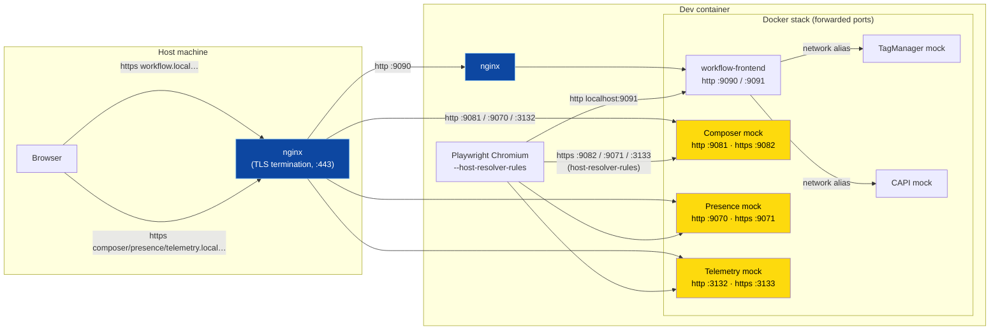

# End-to-end tests

It contains the browser-based, end-to-end (e2e) test suite for
workflow-frontend. Tests are written as Cucumber/Gherkin `.feature` files and
run with [Playwright](https://playwright.dev/) via
[`playwright-bdd`](https://github.com/vitalets/playwright-bdd).

It builds a self-contained local stack in Docker to the
workflow-frontend service and the workflow datastore backend with a number of
of mocked upstream services. The whole end to end tests can run within a machine so
that it can be included as part of our CI workflow later.

## Local stack

The local stack is built with Test Container on top of Docker so that we can
configure and wire up the containers in a more flexible way.

WireMock is used to mock dependencies. Local S3 service is mocked with MinIO 
to serve PanDomain settings and permission cache. We also create a local 
DynamoDB with test data using AWS Local DynamoDB image.

The stack is reached over two different network paths depending on where the
browser runs: a browser running in the host, or Playwright's Chromium
running inside the dev container.

1. **Host browser → nginx on host (SSL termination) → dev container.** From the host,
   the browser talks to the frontend and its APIs over HTTPS using the real
   `*.local.dev-gutools.co.uk` hostnames. A local nginx on the host terminates
   TLS and reverse-proxies each hostname to the matching forwarded dev-container
   port (plaintext HTTP).

   Here we don't set up the nginx config for reverse-proxying services that sit
   outside this repository because those projects already set up ones for development.
   We just bind those services to devcontainer using the same ports so their 
   reverse-proxying rule just works in this setting.

2. **Playwright Chromium → services directly.** Inside the dev container,
   Chromium loads the frontend over plain HTTP via its forwarded port on devcontainer, 
   and reaches the cross-origin APIs (`*.local.dev-gutools.co.uk` hostnames) over HTTPS. 
   The `--host-resolver-rules` launch argument (in Playwright's config for tests and 
   in "run-local-stack.ts" if we build the stack with `yarn dev:local` for development) 
   maps each API hostname straight to the mock's HTTPS port
   (the config `ignoreHTTPSErrors` accepts the self-signed certificates).



## Prerequisites

- **Docker** — must be installed and running. The stack is built and run as
  containers via [testcontainers](https://testcontainers.com/).
- **Node.js** — Tools version is managed by [mise](https://mise.jdx.dev/)
  (see [mise.toml](mise.toml)). `yarn install` installs the JS dependencies.
- **Git SSH access to `guardian/workflow`** — the Datastore backend is checked
  out and built from the [guardian/workflow](https://github.com/guardian/workflow)
  repository. The test setup clones it automatically into
  `e2e-tests/target/workflow-backend/` (see [setup/checkout-datastore](setup/checkout-datastore)).

The dependencies of the e2e-tests and the Playwright Chromium browser are installed
when the devcontainer is built.

## Running the tests

All commands are run from the `e2e-tests/` folder.

```bash
yarn test
```

This generates the BDD test files (`bddgen`) from the feature files, ensures 
the Datastore backend is
checked out, builds the stack, and runs the test suite in headless mode.

### How the frontend is run

The dependency services (datastore, MinIO, DynamoDB and the mocked upstream
APIs) all run as containers, and so does the workflow-frontend app itself. The
app is built and run as a container, mounting the sources live so `sbt run` +
`yarn build-dev` (webpack watch) reload edits to Scala or frontend assets
without rebuilding the image.


### Use host's browser to access Playwright UI

Headed mode is not supported in dev container, but you can run this command to
expose a port for a browser to access its Playwright UI.

```bash
yarn test:ui
```

The Playwright UI can be accessed via `http://localhost:9099/` on the host system.

### Fast test loop with a shared stack

Building the stack on every run is slow. When iterating on tests,
start a long-running stack once and let subsequent test runs reuse it:

```bash
# Terminal 1 — boot the stack and leave it running (opens an authenticated browser)
yarn dev:local

# Terminal 2 — run tests repeatedly against the already-running stack
yarn test
```

The shared stack writes its connection details to a gitignored file that
`global-setup.ts` picks up; when present, the test run skips building containers.
Press `Ctrl+C` in terminal 1 to tear the stack down.

### Use host's browser to access Workflow frontend against the stack

After the long-running stack has started, we can access the Workflow frontend directly
from a browser on the host.

In the dev container, run:

```bash
# boot the stack
yarn dev:local
```

On the host, open this link `https://workflow.local.dev-gutools.co.uk/cookie` to load
the authentication cooke and then get redirected to the Workflow dashboard page.

### Viewing the report

After a run, open the HTML report (traces, videos and screenshots for failed
scenarios are attached):

```bash
yarn test:report
```

Raw artifacts are written to `e2e-tests/target/test-results/` and the report to
`e2e-tests/target/playwright-report/` (both gitignored). Traces/videos/screenshots are
captured on first retry and on failure — see `use` in
[playwright.config.ts](playwright.config.ts).

The test report is served via port 9098 which is mapped to the same port number
of the host. So you can open it by `http://localhost:9098` on your host directly.

## Folder structure

```
e2e/
├── features/          # Gherkin .feature files (one per behaviour area)
├── steps/             # Step definitions + Playwright fixtures wiring features to code
│   ├── fixtures.ts    # Shared test fixtures (stack connection, signIn, mocks, world)
│   └── shared/        # Network-level mocks (presence, telemetry, composer)
├── setup/             # Stack lifecycle + auth helpers (not test steps)
│   ├── stackContainers.ts  # Builds/starts/stops the Docker stack via testcontainers
│   ├── sharedStack.ts      # Reuse a long-running stack across runs
│   ├── panDomainCookie.ts  # Signs pan-domain auth cookies for test roles
│   ├── panDomainKeys.ts    # Generates the pan-domain signing keypair
│   ├── run-local-stack.ts  # Boots a shared long-running stack for `yarn dev:local`
│   └── checkout-datastore  # Clones/updates guardian/workflow backend
├── images/            # Dockerfiles and entrypoint scripts for each container in the stack
├── fixtures/          # Test data and config seeded into the stack
│   ├── conf/          # workflow-frontend + backend config for the local stack
│   ├── db/            # Postgres seed CSVs (sections, desks, stubs…)
│   ├── dynamodb/      # DynamoDB seed data (e.g. editorial support)
│   ├── permissions/   # Permission cache fixture (grants/denies workflow_access)
│   ├── pan-domain-settings/  # Pan-domain auth settings
│   ├── capi-mappings/        # WireMock stubs for CAPI preview
│   ├── preferences-mappings/ # WireMock stubs for the Preferences service
│   ├── tagmanager-mappings/  # WireMock stubs for Tag Manager
├── global-setup.ts    # Playwright global setup: start/reuse stack, write connection file
├── playwright.config.ts
├── mise.toml          # Pinned Node.js version
└── package.json       # Scripts and dev dependencies
```

## How a test run fits together

1. **`global-setup.ts`** starts the stack (or reuses a shared one) and writes its
   base URL and pan-domain signing key to `target/tmp/e2e-active-stack.json`.
2. **`steps/fixtures.ts`** reads that file to point every test at the stack,
   provides a `signIn` helper (pan-domain cookie), a per-scenario `world`
   scratch space, and mock objects (`presence`, `telemetry`, `composerMock`).
3. **`bddgen`** turns the `.feature` files into runnable Playwright tests using
   the step definitions in `steps/`.
4. Playwright runs the scenarios against Chromium.

## Writing tests

- **`.feature` files** follow the workflow-frontend evidence-annotated Gherkin
  conventions. See
  [.github/instructions/feature-files.instructions.md](../.github/instructions/feature-files.instructions.md)
  and the `feature-file-from-templates` skill for authoring guidance.
- **Step definitions** live in `steps/*.steps.ts` and are wired to Playwright
  via `Given`/`When`/`Then` exported from `steps/fixtures.ts`. See the
  [`feature-file-step-definitions`](../.github/skills/feature-file-step-definitions/SKILL.md) 
  skill for how to add missing steps.
- **Auth**: use the `signIn` fixture. Roles map to emails in
  `setup/panDomainCookie.ts`, which must match entries in
  `fixtures/permissions/permissions.json`.
- **Mocking**: upstream services inside the stack are seeded via WireMock
  fixtures.
