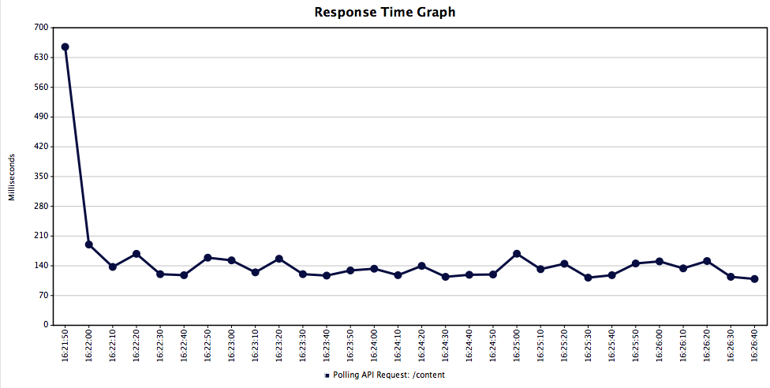
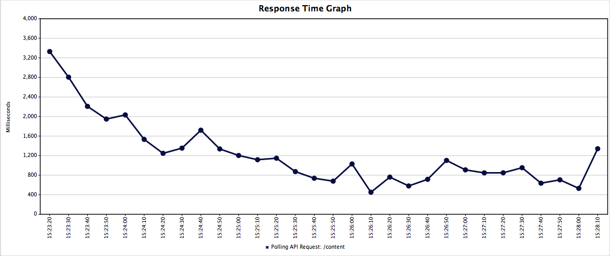
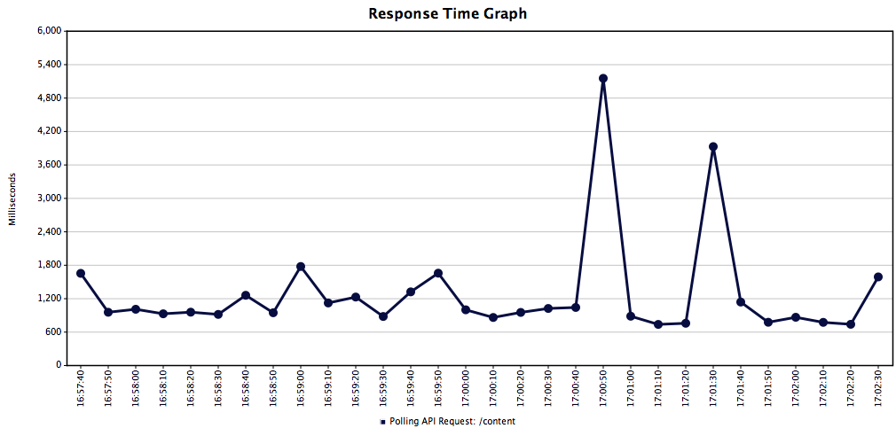
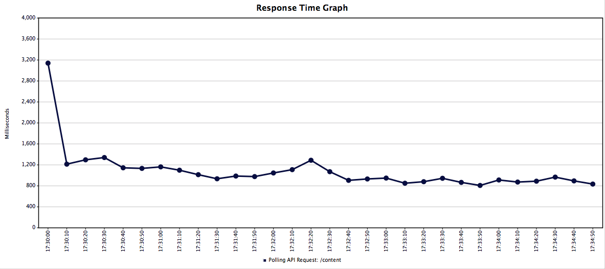

# Workflow load testing analysis
**Date:** November 2014

**Target:** "400 users"

## Result Summary
Under Max load, workflow will just hold up with the current stack config and at the current size of the dataset within the DB - responding in around 1-2s per API request. Although as data grows, performance will take a hit.

## Test overview

Testing for 400 concurrent users.

Testing considerations:
- Workflow has 1 "dynamic" html response, which is loaded on page load only. Ideally only requested once per day.
- Tested for a single API request on load (see GH issue #208)
- API Polled every 5 seconds for each user
- 84 client-side assets (at time of testing - theres more now...) requested on page load.

Not tested yet:
- Data changes via API under load: POST/PUT
- Presence

## Observations

UI:
- Performance is fine with ~200 visible items. Even under load on the editorial Mac.
- Horrible performance, and script load time warnings on ~1000 visible items.

API / DB:
- Responses slow to an average of 1.107s when hitting API at rate at which it would be polled for 400 concurrent users with current DB size (~2200 rows).
- API performs very well with small dataset in db (~300 rows).

Static assets:
- Performance generally good, ~40ms average response. Higher than expected CPU usage: 17-39%.
- We do have a LOT of assets, however they're generally only loaded once on page load, so server load should be minimal, but also should be improved.

## Recommendations
DB perf:
- currently t1.micro (1 CPU, 0.6GB memory, "Very low" network) => upgrade to t2.micro (1 GB ram) or t2.small (2 GB ram)
- archive ( > 1 week ) / delete old stuff ( > 2 weeks )
- due, published, and last modified core filters are specific to the millisecond - rounding to the nearest minute (or even hour, day) could improve query performance

API perf:
- Reduce unnecessary API calls / throttle from client: GH issue #208
- GET /api/content makes two separate queries => combine to single query
- short term cache in front of db (reverse proxy) should improve performance of similar requests under short timeframes
- GZIP responses when of a certain size
- Switch to SSE from polling
- Contingency: Increase polling time from 5s to 10s or 15s.

UI perf:
- Update to Angular 1.3 and use 1 way bindings where possible
- Profile UI, analyse digest cycle: GH #177
- Experiment / research: hiding unseen DOM elements off the page, Virtual DOM?
- Contingency: Limit max display of items / Paginate UI and API

Static assets:
- 84 client-side assets => Bundle / concat to reduce requests
- Version assets on build and increase cache time to improve client-side caching (currently 1 min cache)
- Reverse proxy in front of play, or serve assets directly from nginx to reduce CPU usage - frees up Play to do more important things
- SPDY on nginx :)

## Test results

### Initial request
Initial page load

URL | /
--- | ---
Load | 400 requests / second
Average | 1.32s
CPU | 57%

### API poll every 10 seconds
400 users Poll every 10 seconds = 40 requests / second

URL | /api/content
--- | ---
Load | 40 r/s
DB size | ~300 rows
Average | 0.145s
Min | 0.066s
Max | 2.2s
Max CPU | 84%

### API poll every 5 seconds
400 users Poll every 5 seconds = 80 requests / second

URL | /api/content
--- | ---
Load | 80 r/s
DB size | ~300 rows
Average | 0.947s
Min | 0.070s
Max | 5.9s
Max CPU | 99%

### API poll every 5 seconds (prod data)
400 users poll every 5 seconds = 80 requests / second. ~2200rows (prod dump of ~2k rows)

URL | /api/content
--- | ---
Load | 80 r/s
DB size | ~2200rows (prod dump of ~2k rows)
Average | 1.107s
Min | 0.114s
Max | 13s
Max CPU | 98% (peaks then levels off ~50%)
Max DB CPU | 100%
Throughput | 58/s (target: 80/s)

### API poll every 5 seconds (5000 rows)
400 users Poll every 5 seconds = 80 requests / second. ~5000rows (prod dump + 2800 extra published rows filtered out)

URL | /api/content
--- | ---
Load | 80 r/s
DB size | ~5000rows (prod dump + 2800 extra published rows filtered out)
Average | 2.191s
Min | 0.051s
Max | 23.69s
Max CPU | 89%
Max DB CPU | 100%
Throughput | 33.5/s (target: 80/s)

Some ELB 503s (backend at capacity) and timeouts.

### API poll every 5 seconds (2200 + 1000 extra rows)
400 users Poll every 5 seconds = 80 requests / second. ~2200rows (prod dump + 1000 extra visible)

*60% failed requests!*

URL | /api/content
--- | ---
Load | 80 r/s
DB size | ~5000rows (prod dump + 2800 extra published rows filtered out)
Average | 7.46s
Min | 0.033s
Max | 84.7s
Max CPU | 90%
Max DB CPU | 100%
Throughput | 10/s (target: 80/s)

### API poll every 5 seconds (100 visible)
400 users Poll every 5 seconds = 80 requests / second. ~2200rows, 100 visible (prod dump (38 visible) + 62 extra visible)

URL | /api/content
--- | ---
Load | 80 r/s
DB size | ~2200rows, 100 visible (prod dump (38 visible) + 62 extra visible)
Average | 1.78
Min | 0.170s
Max | 6.9s
Max CPU | 98%
Max DB CPU | 100%
Throughput | 42.3/s (target: 80/s)

### API poll every 5 seconds (1000 rows)
400 users Poll every 5 seconds = 80 requests / second + random queries. ~1000rows

URL | /api/content
--- | ---
Load | 80 r/s
DB size | 1000 rows
Average | 1.022
Min | 0.121s
Max | 8.1s
Max CPU | 97%
Max DB CPU | 100%
Throughput | 64.8/s (target: 80/s)

### Static assets
2 users + 4 keep-alive threads each (browser simulation), 84 total requests

URL | /api/content
--- | ---
Load | 2 r/s
Average | 0.037s
CPU | 17-39% (higher on more threads)
